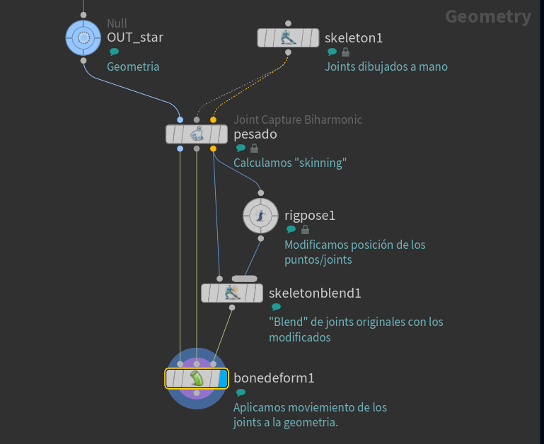

## MoCAP

Masterclass de pegar animación MoCap en FBX a otro character FBX :  https://www.youtube.com/watch?v=KHPpztrZtyw

## KineFX
https://www.sidefx.com/docs/houdini/character/kinefx/index.html   
[Working with skeletons](https://www.sidefx.com/docs/houdini/character/kinefx/skeletons.html#creatingskels)
### Conceptos:
- Las curvas son tomadas como la estructura jerarquica: los puntos son donde están los "joints" y la conexion entre ellos (*"poly lines"*) define la relación padre/hijo
- Un punto es un *joint* si tiene los  atributos "name" y "transform"

### Nodos KineFX interesantes

- `skeleton` : para dibujar joints (puntos unidos por curvas) ([docs](https://www.sidefx.com/docs/houdini/character/kinefx/skeletons.html#creatingskels))
- `Reparent Joints` : emparenta los puntos para que el padre pueda "arrastrar" al hijo.
- `Joint Capture Biharmonic` y `Capture Proximity`: hace el "pesado" automatico de la geometria para deformarla luego.
- `Joint Capture Paint`  para pintar los pesos a mano ([docs](https://www.sidefx.com/docs/houdini/nodes/sop/kinefx--jointcapturepaint.html)).
   - Tecla `A` para seleccionar joint
   - Tecla `F` muestra menú radial
   - Tecla `S` seleccionar primitivas a pintar.
- `Rig Pose` : Aquí podemos modificar la posición de los puntos (joints) para animarlos o preparar un rig. Si están conectados el "padre" arrastra al "hijo".
- `Skeleton Blend` : podemos hacer "blend" de diferentes esqueletos (modificados por `rig pose` por ejemplo.
- `Bone Deform` : realiza la deformación de la geometría que tiene los atributos de "captura" con el esqueleto.

## ANIMACION (editors y viewport)    

***Shortcuts pata TODAS las ventanas***   

K : keyframe en todas las transformaciones (TRS)

***PANEL shortcuts***   

SHIFT+left mouse button : añadir los canales animados al "Animation editor"   
SHIFT+middle mouse button : añadir el canal que se selecciona al "Animation editor" aunque no tenga animación.   

***ANIMATION EDITOR shortcuts***   
   
CONTROL + click on keyframe : mover libremente el keyframe en tiempo y valor   
CONTROL drag en la tangente : cambiar solo la longitud sin cambiar el "slope" (angulo del keyframe)   
ALT + left click : añadir keyframe en las curvas en el punto del tiempo que tenemos debajo del ratón (TODAS las curvas).   
ALT + SHIFT + left click : añadir keyframe en la curva en el punto del tiempo que tenemos debajo del ratón (SOLO en la que pinchamos).   

Desplazar 10 frames los keyframes seleccionados: pon "+10" en el campo "Frame"   
Desplazar -10 frames los keyframes seleccionados: pon "+-10" en el campo "Frame"   
