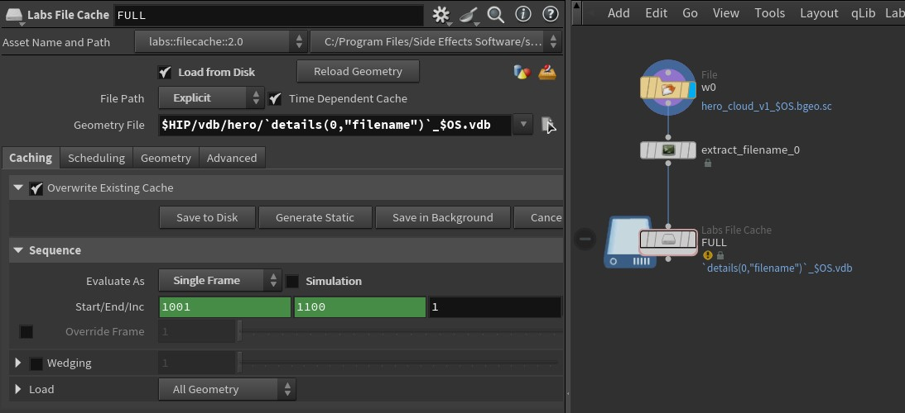

## NAME HANDLING dentro de SOP, OBJ y en ROP   


### Incorporar el nombre  del nodo del contexto OBJ   
Con la funcion : `opname("..")`.

Por ejemplo ponemos en un "file cache node" el nombre del nodo OBJ que lo contiene:
```C++
$HIP/vdb/hero/`opname("..")`_FULL.vdb
```


### Manipular nombre en el campo "file"   
padzero: para añadir ceros al numero de frame. En caso de numeración sin ceros, eliminarlo.   

Looping (de 0  a 250):   
```C++
$HIP/maps/my_map.`padzero(4,$F%251)`.exr
```
Looping (de 1  a 250):   
```C++
$HIP/maps/my_map.`padzero(4,($F-1)%250+1)`.exr
```
Offset:   
```C++
$HIP/maps/my_map.`padzero(4,$F +10)`.exr
```
Hold:   
```C++
$HIP/maps/my_map.`padzero(4, min($F , 250))`.exr // last
$HIP/maps/my_map.`padzero(4, max($F , 1))`.exr // first
$HIP/maps/my_map.`padzero(4, clamp($F,1,250))`.exr // both
```
### Usar nombre en el campo "file" de un nodo de input como output de otro nodo (cache)

Por ejemplo para convertir de forma automatica ficheros en disco. Usamos el nodo `extract filename` para poner atributos en "details" con la info,



### Op-Expressions   

mirar esto: https://vfxbrain.wordpress.com/2018/10/02/opinput/

Simple código para poner en un VEX y obtener en nombre del nodo en OBJ o uno mismo o el primer input
```C++
// Get name of node (myself): `opname(".")`
// Get name of OBJ node: `opname("..")`
// Get node name of fist input: `opinput(".",0)`
s@nodename=chs("Name");
printf(@nodename+" h ");
```
