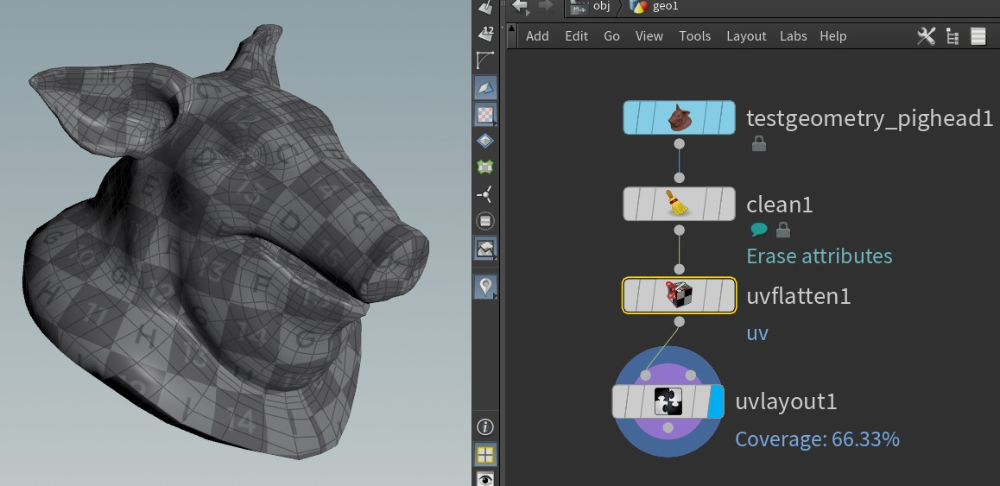
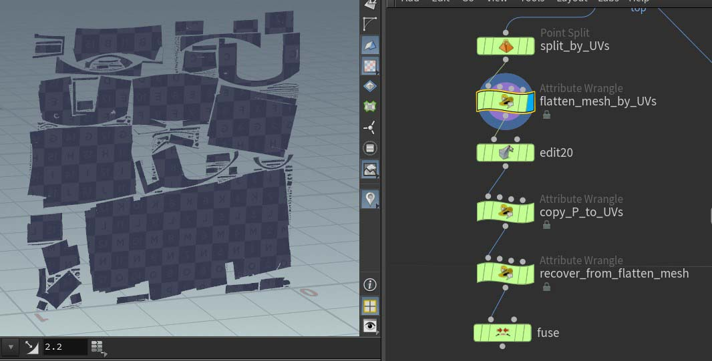

### TIPS   
- `UV SNAPSHOT` : dentro de SOPs, ratón encima del nodo que queramos hacer el "snapshot", boton derecho y `save --> UV Texture image`


SOPS:

- SPLIT UV SEAMS: separa las UVs para que no tenga problemas al procesarlo despues (con un nodo "remesh" poir ejemplo).
- `ReMesh` destroza las UVs. Mejor hacer luego un `LABS UV transfer` para arreglarlas.

### WORKFLOW TÍPICO (manual)   



1) `UV flatten` : nodo para seleccionar los edges, y trocear las UVs. Trocear modelo hasta conseguir una distribución del grid de UVs sin demasiadas distorsiones
2) `UV Layout` : reorganiza las islas de UVs sin solaparse y rellenando el espacio.
3) `UV QuickShade` : Simplemente para comprobar que todo está funcionando


### DESPLEGAR UVs como geometría normal y volver a convertir en UVs (para usar herremientas de modelado al hacer UVs)   



1) Nodo `Point Split` para cortar mesh por las "UV islands"
2) Wrangler para desplegar UVs en P:
```C++
// Run on points // desplegamos UVs en la P
v@rest = @P;
@P = vertex(0, "uv", pointvertex(0, @ptnum));
```
3) Nodos para manipular las UVs como si fueran un mesh (transform, edit, etc)
4) Warngler para copiar las nuevas UVs de la P editada
```C++
// run on vertex
int current_point=vertexpoint(0,i@vtxnum);
@uv = point(0,"P", current_point);
```
6) Wrangler para recuperar P en su forma original
```C++
// Run on points // Return them back
@P = v@rest;
```
