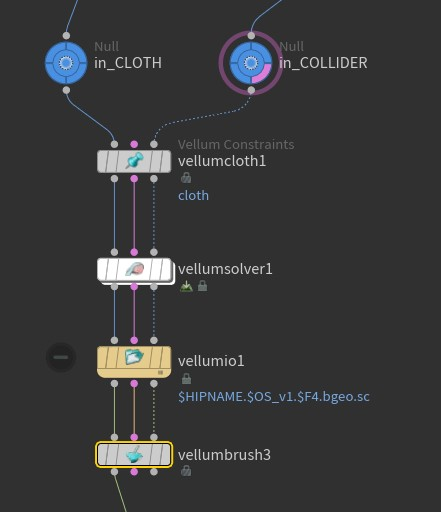

### VELLUM BRUSH  

Notas sobre "Vellum Brush".   

**NOTAS.**   

- REMESH (con triengulos): suele funcionar mejor con geometria aplicado un `remesh`, ya que los pliegues y otros detalles suelen tener menos "artifacts".
- COLISIONES: intentar hacerlo con VDBs siempre que sea posible. Si no es posible, evitar angulos duros (sharp), con un `polybevel` suele ser suficiente. Si no, la sim tendrá problemas.
- CONSTRAINT // PIN: Si los ponemos al hacer el `vellum cloth` luego no podremos moverlos.

En los parametros a tener en cuenta:   

- `Density`: indica lo "pesado" que es el tejido.
- `Stretch`: Si se comprime / expande (elasticidad).
- `Bend` : Cuanto se dobla (rigidez / flexibilidad).
- `Sub Steps`: poner a 4, como en el `Vellum Solver`.

**MODOS de MANIPULACIÓN del CLOTH**   
   
- `Brush` : mueve suavemente el cloth en la dirección indicada.
- `Drag` : "arrastra" el cloth, más contundente que `Brush`.
- `Contract / Expand` : para "arrugar" y "planchar" el tejido.
- `Rotate` : pues eso, rota respecto al "brush".
- `Crease / Ruffle` : hace los polygonos del cloth más pequeños/grandes. Es como un "zurcido" o "expandido"

**WORKFLOW**   

1) CLOTH grande // Utilizar un `VELLUM SOLVER` para hacer la forma inicial, y luego con `vellum brush` hacer el acabado.

- Poner los sub-steps a 4 y los constraint iteratios a unos 200 (si no, el tejido se simula mal)
     

2) CLOTH pequeño // Empezar directamente con el `vellum brush`

**TIPS**   

- Grabar una `"sesión en vivo"` de "Vellum Brush":
   1) Entrar en el tool de Vellum Brush, y en el solver llamado `dopnet minimal` activamos la caché.
   2) conectamos un `null` a esta cache (para usarlo fuera del  "Vellum Brush").
   3) Le damos al play y usando el "Vellum Brush". Vemos el resultado al visualizar el nulo.
   4) En el nivel de arriba (SOP), hacemos un `Object merge` que apunte al null que hemos creado dentro del "Vellum Brush".
   5) Conectamos un `file node` en modo "write" al `Object merge`
   6) Le damos al play y se grabará en disco.
